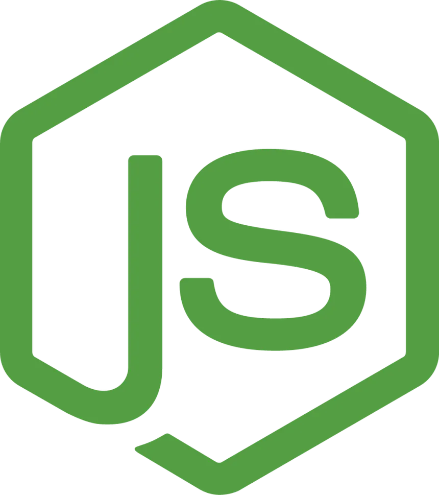
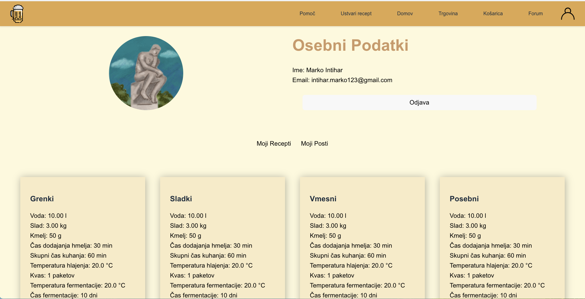

# HomeBrewery
HomeBrewery je spletna aplikacija namenjena ljudem, ki bi radi začeli z varjenjem piva ali pa se naučili kaj novega. HomeBrewery še poleg podobnih aplikacij omogoča uporabnikom 
avtomatsko dodajanje dogodkov na Google Koledar glede na recept, ki ga ustvarijo.

### Člani ekipe
- Andrej Majhen
- Nino Lisjak
- Marko Intihar

---

### Opis Projekta
Na aplikaciji se lahko uporabnik nauči o postopku varjenja piva. Vse pripomočke in surovine lahko kupi na spletni trgovini aplikacije. Ko bo uporabnik naletel na težave ima dve opciji za 
iskanje pomoči. HomeBrewery ponuja forum kjer lahko objavi svoje vprašanje ali pa poišče, če je kdo drug imel podoben problem. Objavo lahko "upvote-a", "downvote-a" ali pa komentira. To 
lahko stori po tem ko se prijavi s svojim Google računom. Druga opcija za reševanje problemov je uporaba "real time chat-a" kjer lahko komunicira z strokovnjaki. Ko uporabnik pritisne na pomoč
se bo ustvarila soba in strokovnjaki bodo dobili povezavo do sobe. Ko se uporabnik počuti pripravljenega lahko ustvari svoj plan varjenja oziroma recept, kjer se bodo časovno pomembni dogodki
samodejno dodali na uporabnikov Google kolendar.


---

### Predvideni uporabniki
Aplikacija je namenjana osebam, ki želijo začeti z varjenjem piva ali pa tudi tistim, ki so že domači v svetu varjenja domačega piva in se želijo naučiti kaj novega ali pomagati drugim.

---

### Uporabljene tehnologije
| React | Typescript| Vite | Ably | NodeJs |
| --- | --- | --- | --- | --- |
|  |   |  |  |  |


### Končni izgled aplikacije



---

### Deployment
Frontend in backend sta deployana na [Vercel](vercel.com). Frontend in Backend repozitorija sta ločena:
 - Link do [backenda](https://github.com/markointihar/HomeBreweryServer).
 - Link do [frontenda](https://github.com/markointihar/HomeBrewery)

---

### Navodila lokalne namestitve
1. Kloniraj repozitorij
2. Naložimo vse potrebno
```
cd HomeBrewery
npm i
```
3. Zaženemo aplikacijo `npm run dev`
4. Na frontendu in backendu potrebujete .env datoteko. Pišite nam in vam pošljemo potrebne podatke.


